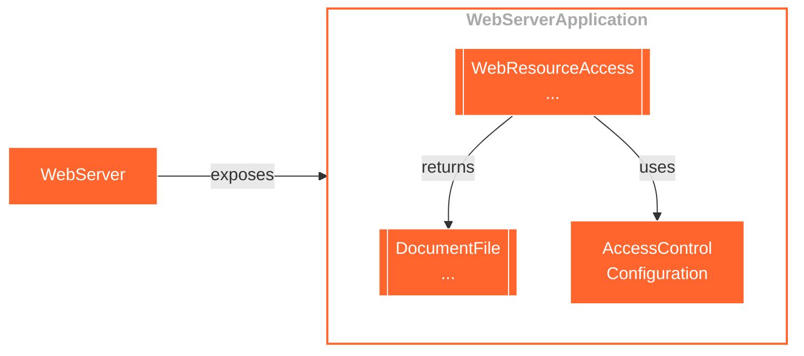
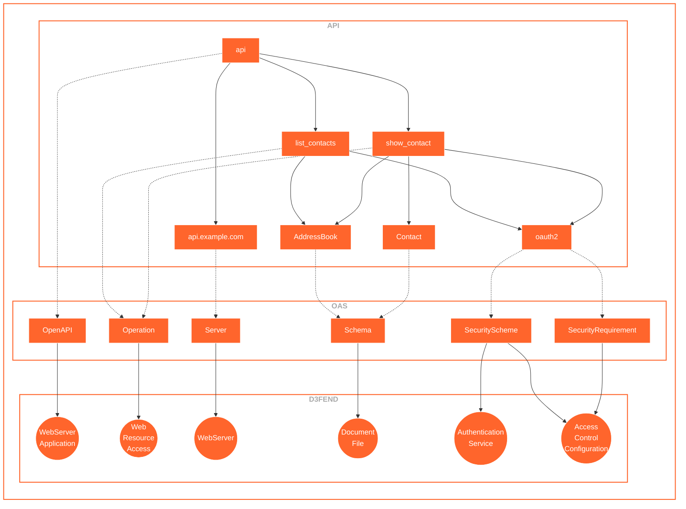
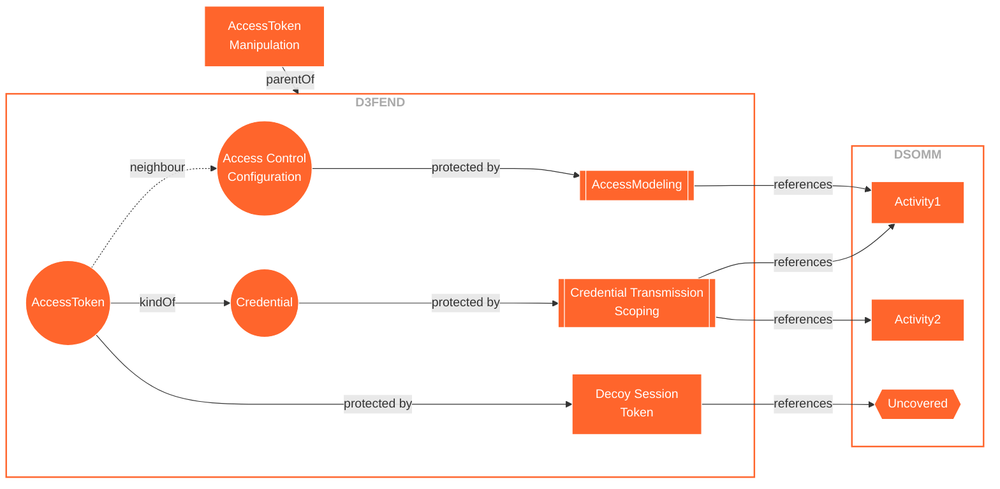
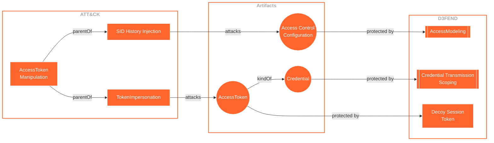
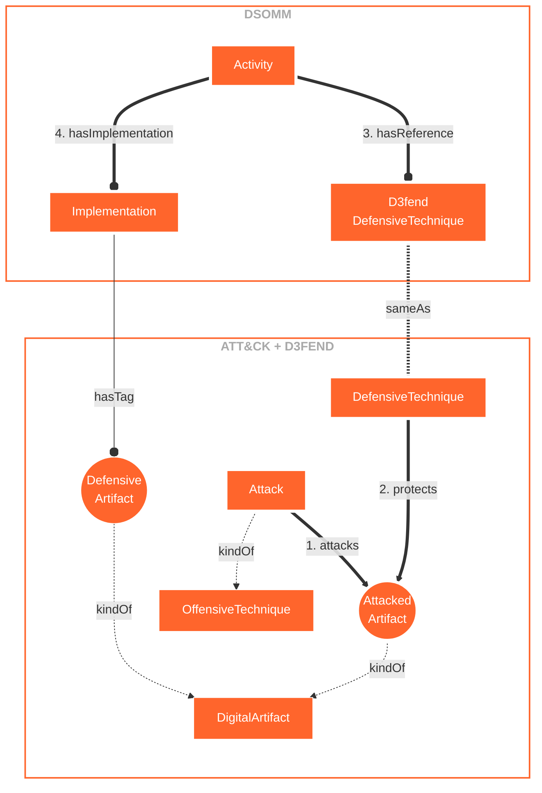

# DSOMM e D3FEND

## Pipeline

```mermaid
flowchart LR
    classDef default stroke:white,color:#fff,clusterBkg:none,fill:#ff652c
    classDef cluster font-weight: bold,fill:none,color:darkgray,stroke:#ff652c,stroke-width:2px
    classDef pad fill:none, stroke:none, opacity:0
    classDef bounded_context stroke-dasharray:5 5


```

## OpenAPI + D3FEND 2



## OpenAPI + D3FEND 1



## DSOMM Activities




## D3FEND Neighbors



## DSOMM Data Model


